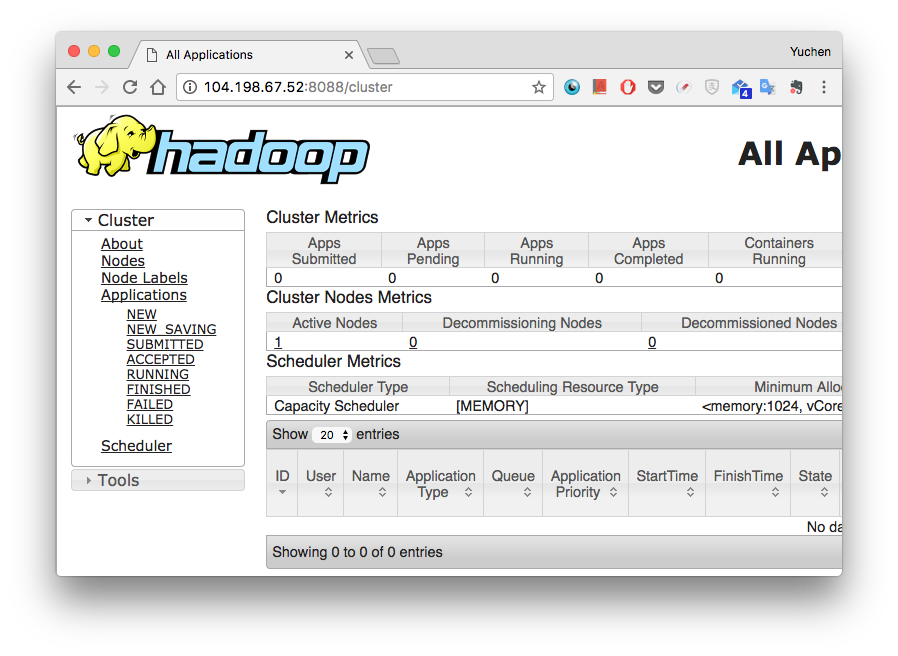

# Install Hadoop and HBase

## Introduction

HBase is a data model that is designed to provide quick random access to huge amounts of structured data. This tutorial shows how to set up HBase on Hadoop File Systems
using Google Cloud Instance.

One can store the data in HDFS through HBase. Data consumer reads/accesses the data in HDFS randomly using HBase. HBase sits on top of the Hadoop File System and provides read and write access.

Apart from HBase, applications such as Cassandra, couchDB, Dynamo, and MongoDB store huge amounts of data and support random access to the data.

**Storage Mechanism in HBase**

HBase is a column-oriented database and the tables in it are sorted by row. The table schema defines only column families, which are the key value pairs. A table have multiple column families and each column family can have any number of columns. Subsequent column values are stored contiguously on the disk. Each cell value of the table has a timestamp. In short, in an HBase:

* Table is a collection of rows.
* Row is a collection of column families.
* Column family is a collection of columns.
* Column is a collection of key value pairs.

**HBase Architecture**

In HBase, tables are split into regions and are served by the region servers. Regions are vertically divided by column families into "Stores". Stores are saved as files in HDFS. Shown below is the architecture of HBase.

HBase has three major components: 
the client library, 
a master server, 
and region servers. 
Region servers can be added or removed as per requirement.

*Master Server*

* Assigns regions to the region servers and takes the help of Apache ZooKeeper for this task.
* Handles load balancing of the regions across region servers. It unloads the busy servers and shifts the regions to less occupied servers.
* Maintains the state of the cluster by negotiating the load balancing.
* Is responsible for schema changes and other metadata operations such as creation of tables and column families.

*Region server*

Regions are tables that are split up and spread across the region servers. The region servers have regions that:

* Communicate with the client and handle data-related operations.
* Handle read and write requests for all the regions under it.
* Decide the size of the region by following the region size thresholds.
* When we take a deeper look into the region server, it contain regions and stores as shown below:

The store contains memory store and HFiles. Memstore is just like a cache memory. Anything that is entered into the HBase is stored here initially. Later, the data is transferred and saved in Hfiles as blocks and the memstore is flushed.


*Zookeeper*

Zookeeper is an open-source project that provides services like maintaining configuration information, naming, providing distributed synchronization, etc.

* Zookeeper has ephemeral nodes representing different region servers. Master servers use these nodes to discover available servers.
* In addition to availability, the nodes are also used to track server failures or network partitions.
* Clients communicate with region servers via zookeeper.
* In pseudo and standalone modes, HBase itself will take care of zookeeper.

## Google Cloud Instance

For the purpose of this tutorial, we use google clound instance virtual machine to demontrate how to install hbase. However, in reality, if you should most likely use [Bigtable](https://cloud.google.com/bigtable/docs/) provided by Google.

> **Bigtable**
> 
> Cloud Bigtable is a fully managed NoSQL database that supports the popular open-source Apache HBase 1.0 API. You can provision Cloud Bigtable instances for your workload, then use the Bigtable HBase client to develop applications using the standard open-source Big Data tools you're familiar with.

But we will install HBase with a barebone Ubuntu virtual machine here, just for fun. 

To begin with, let's create a new project,


and a most recent version of Ubuntu.


To keep things simple, we will allow both http and https traffics.


That's all we need for setup, now let's SSH to the machine and start the dirty work. 

## Create Account

It is recommended to create a separate user for Hadoop to isolate the Hadoop file system from the Unix file system. We created a user `hadoop` with password `password` below.

	$ sudo useradd hadoop
	$ sudo passwd hadoop
	Enter new UNIX password: password
	Retype new UNIX password: password
	passwd: password updated successfully

SSH setup is required to perform different operations on the cluster such as start, stop, and distributed daemon shell operations. 

The following commands are used to generate a key value pair using SSH. Copy the public keys form id_rsa.pub to authorized_keys, and provide owner, read and write permissions to authorized_keys file respectively.

	$ ssh-keygen -t rsa
	Generating public/private rsa key pair.
	Enter file in which to save the key (/home/yzhong_cs/.ssh/id_rsa): 
	Enter passphrase (empty for no passphrase): 
	Enter same passphrase again: 
	Your identification has been saved in /home/yzhong_cs/.ssh/id_rsa.
	Your public key has been saved in /home/yzhong_cs/.ssh/id_rsa.pub.
	The key fingerprint is:
	SHA256:w6PwtUhfZ/vBwTG3P5kXeP2GuPW0b39yElH4HWAz0VE yzhong_cs@instance-2
	The key's randomart image is:
	+---[RSA 2048]----+
	|             *+oE|
	|            . +o.|
	|              oo+|
	|       .     .o+=|
	|    . . S . o.o=.|
	|     + = = o +oo*|
	|      + o   o ==*|
	|             +o=B|
	|            . .*B|
	+----[SHA256]-----+
	
	
	$ cat ~/.ssh/id_rsa.pub >> ~/.ssh/authorized_keys
	$ chmod 0600 ~/.ssh/authorized_keys
	
Verify ssh installation is correct.
	
	$ ssh localhost
	The authenticity of host 'localhost (127.0.0.1)' can't be established.
	ECDSA key fingerprint is SHA256:foTRdAvYNamSZnErNmLUAuKC+OL/3YtqkzbdOraTe2c.
	Are you sure you want to continue connecting (yes/no)? yes
	Warning: Permanently added 'localhost' (ECDSA) to the list of known hosts.
	Welcome to Ubuntu 16.10 (GNU/Linux 4.8.0-51-generic x86_64)
	
	 * Documentation:  https://help.ubuntu.com
	 * Management:     https://landscape.canonical.com
	 * Support:        https://ubuntu.com/advantage
	
	  Get cloud support with Ubuntu Advantage Cloud Guest:
	    http://www.ubuntu.com/business/services/cloud
	
	0 packages can be updated.
	0 updates are security updates.
	
	New release '17.04' available.
	Run 'do-release-upgrade' to upgrade to it.
	
	
	Last login: Sun May 14 02:38:00 2017 from 173.194.90.32

Finally, don't forget to exit from ssh.

	$ exit
	logout
	Connection to localhost closed.
	
## Install Java

If you have Java installed on the machine, you can skip this step. Otherwise, let's install it.
	
	$ sudo apt-get update
	$ sudo apt-get install default-jre
	$ sudo apt-get install default-jdk

And check its version to make sure that we've installed java successfully. 

	$ java -version
	openjdk version "1.8.0_131"
	OpenJDK Runtime Environment (build 1.8.0_131-8u131-b11-0ubuntu1.16.10.2-b11)
	OpenJDK 64-Bit Server VM (build 25.131-b11, mixed mode)

For setting up `PATH` and `JAVA_HOME` variables, add the following commands to ~/.profile file.
	
	export JAVA_HOME=/usr/lib/jvm/java-1.8.0-openjdk-amd64
	export PATH=$PATH:$JAVA_HOME/bin

And follow by

	$ source ~/.profile

## Install Hadoop

Go to the apache website to check for the most recent version of hadoop [http://hadoop.apache.org/releases.html](http://hadoop.apache.org/releases.html) and also pick a recommanded remote url. 

We download hadoop and put it under `/usr/local/hadoop` folder.

	$ wget http://apache.mirrors.tds.net/hadoop/common/hadoop-2.8.0/hadoop-2.8.0.tar.gz
	$ tar -xzvf hadoop-2.8.0.tar.gz
	$ sudo mv hadoop-2.8.0 /usr/local/hadoop

Quickly, check hadoop version:

	$ /usr/local/hadoop version
	Hadoop 2.8.0
	Subversion https://git-wip-us.apache.org/repos/asf/hadoop.git -r 91f2b7a13d1e97be65db92ddabc627cc29ac0009
	Compiled by jdu on 2017-03-17T04:12Z
	Compiled with protoc 2.5.0
	From source with checksum 60125541c2b3e266cbf3becc5bda666
	This command was run using /usr/local/hadoop/share/hadoop/common/hadoop-common-2.8.0.jar

Set `JAVA_HOME` in the `hadoop-env.sh` shell script under `/usr/local/hadoop/etc/hadoop/` folder. 
	
	# The only required environment variable is JAVA_HOME.  All others are
	# optional.  When running a distributed configuration it is best to
	# set JAVA_HOME in this file, so that it is correctly defined on
	# remote nodes.
	# The java implementation to use.
	export JAVA_HOME=/usr/lib/jvm/java-1.8.0-openjdk-amd64

Validate hadoop installation by running the example project: 

	$ mkdir ~/input
	$ cp /usr/local/hadoop/etc/hadoop/*.xml ~/input
	$ /usr/local/hadoop/bin/hadoop jar /usr/local/hadoop/share/hadoop/mapreduce/hadoop-mapreduce-examples-2.8.0.jar grep ~/input ~/grep_example 'principal[.]*'
	
Results are stored in the output directory and can be checked by running cat on the output directory:

	$ cat ~/grep_example/*
	6       principal
	1       principal.

The MapReduce task found one occurrence of the word principal followed by a period and six occurrences where it was not. Running the example program has verified that our stand-alone installation is working properly. 

Set `HADOOP_HOME` and `PATH` in `~/.profile`, 
	
	export HADOOP_HOME=/usr/local/hadoop
	export PATH=$PATH:$HADOOP_HOME/sbin:$HADOOP_HOME/bin

And again,

	$ source .profile

## Hadoop Configurations

All the hadoop configuration files are store under the following folder: 

	cd $HADOOP_HOME/etc/hadoop

**core-site.xml**

The core-site.xml file contains information such as the port number used for Hadoop instance, memory allocated for file system, memory limit for storing data, and the size of Read/Write buffers.

Open core-site.xml and add the following properties in between the `<configuration>` and `</configuration>` tags.

```
<configuration>
   <property>
      <name>fs.default.name</name>
      <value>hdfs://localhost:9000</value>
   </property>
</configuration>
```


**hdfs-site.xml**

The hdfs-site.xml file contains information such as the value of replication data, namenode path, and datanode path of your local file systems, where you want to store the Hadoop infrastructure.

```
<configuration>
   <property>
      <name>dfs.replication</name >
      <value>1</value>
   </property>
	
   <property>
      <name>dfs.name.dir</name>
      <value>file:///home/hadoop/hadoopinfra/hdfs/namenode</value>
   </property>
	
   <property>
      <name>dfs.data.dir</name>
      <value>file:///home/hadoop/hadoopinfra/hdfs/datanode</value>
   </property>
</configuration>
```

**yarn-site.xml**

```
<configuration>
   <property>
      <name>yarn.nodemanager.aux-services</name>
      <value>mapreduce_shuffle</value>
   </property>
</configuration>
```

**mapred-site.xml**

This file is used to specify which MapReduce framework we are using. By default, Hadoop contains a template of yarn-site.xml. First of all, it is required to copy the file from mapred-site.xml.template to mapred-site.xml file using the following command.

	$ cp mapred-site.xml.template mapred-site.xml

```
<configuration>
   <property>
      <name>mapreduce.framework.name</name>
      <value>yarn</value>
   </property>
</configuration>
```

**Verifying Hadoop installation**

	$ cd ~
	$ sudo su
	$ hdfs namenode -format
	...
	...
	...
	17/05/14 20:43:10 INFO namenode.FSImage: Allocated new BlockPoolId: BP-1902175770-10.128.0.3-1494794590744
	17/05/14 20:43:10 INFO common.Storage: Storage directory /home/hadoop/hadoopinfra/hdfs/namenode has been successfully formatted.
	17/05/14 20:43:10 INFO namenode.FSImageFormatProtobuf: Saving image file /home/hadoop/hadoopinfra/hdfs/namenode/current/fsimage.ckpt_0000000000000000000 using no compression
	17/05/14 20:43:10 INFO namenode.FSImageFormatProtobuf: Image file /home/hadoop/hadoopinfra/hdfs/namenode/current/fsimage.ckpt_0000000000000000000 of size 321 bytes saved in 0 seconds.
	17/05/14 20:43:11 INFO namenode.NNStorageRetentionManager: Going to retain 1 images with txid >= 0
	17/05/14 20:43:11 INFO util.ExitUtil: Exiting with status 0
	17/05/14 20:43:11 INFO namenode.NameNode: SHUTDOWN_MSG: 
	/************************************************************
	SHUTDOWN_MSG: Shutting down NameNode at instance-2/10.128.0.3
	************************************************************/


**Verifying Hadoop dfs**

```
yzhong_cs@instance-2:~$ start-dfs.sh
Starting namenodes on [localhost]
localhost: starting namenode, logging to /usr/local/hadoop/logs/hadoop-yzhong_cs-namenode-instance-2.out
localhost: starting datanode, logging to /usr/local/hadoop/logs/hadoop-yzhong_cs-datanode-instance-2.out
Starting secondary namenodes [0.0.0.0]
The authenticity of host '0.0.0.0 (0.0.0.0)' can't be established.
ECDSA key fingerprint is SHA256:Wqxi6v86+591GR4M7UhZi8fCMtDk11GTeC1BDBdEXeM.
Are you sure you want to continue connecting (yes/no)? yes
0.0.0.0: Warning: Permanently added '0.0.0.0' (ECDSA) to the list of known hosts.
0.0.0.0: starting secondarynamenode, logging to /usr/local/hadoop/logs/hadoop-yzhong_cs-secondarynamenode-instance-2.out
```

```
yzhong_cs@instance-2:~$ start-dfs.sh
Starting namenodes on [localhost]
localhost: starting namenode, logging to /usr/local/hadoop/logs/hadoop-yzhong_cs-namenode-instance-2.out
localhost: starting datanode, logging to /usr/local/hadoop/logs/hadoop-yzhong_cs-datanode-instance-2.out
Starting secondary namenodes [0.0.0.0]
The authenticity of host '0.0.0.0 (0.0.0.0)' can't be established.
ECDSA key fingerprint is SHA256:Wqxi6v86+591GR4M7UhZi8fCMtDk11GTeC1BDBdEXeM.
Are you sure you want to continue connecting (yes/no)? yes
0.0.0.0: Warning: Permanently added '0.0.0.0' (ECDSA) to the list of known hosts.
0.0.0.0: starting secondarynamenode, logging to /usr/local/hadoop/logs/hadoop-yzhong_cs-secondarynamenode-instance-2.out
yzhong_cs@instance-2:~$ stop-dfs.sh
Stopping namenodes on [localhost]
localhost: no namenode to stop
localhost: no datanode to stop
Stopping secondary namenodes [0.0.0.0]
0.0.0.0: stopping secondarynamenode
yzhong_cs@instance-2:~$ start-dfs.sh
Starting namenodes on [localhost]
localhost: starting namenode, logging to /usr/local/hadoop/logs/hadoop-yzhong_cs-namenode-instance-2.out
localhost: starting datanode, logging to /usr/local/hadoop/logs/hadoop-yzhong_cs-datanode-instance-2.out
Starting secondary namenodes [0.0.0.0]
0.0.0.0: starting secondarynamenode, logging to /usr/local/hadoop/logs/hadoop-yzhong_cs-secondarynamenode-instance-2.out
```

**Verifying Yarn script**

```
yzhong_cs@instance-2:~$ start-yarn.sh
starting yarn daemons
starting resourcemanager, logging to /usr/local/hadoop/logs/yarn-yzhong_cs-resourcemanager-instance-2.out
localhost: starting nodemanager, logging to /usr/local/hadoop/logs/yarn-yzhong_cs-nodemanager-instance-2.out
```

That's all about installing hadoop. We will check the hadoop dashboard with the following urls:

* [http://104.198.67.52:50070/dfshealth.html](http://104.198.67.52:50070/dfshealth.html)

* [http://104.198.67.52:8088/cluster](http://104.198.67.52:8088/cluster)


Well, don't forget to replace 104.198.67.52 with your vm's ip address.


## Install Hbase

We can install HBase in any of the three modes: Standalone mode, Pseudo Distributed mode, and Fully Distributed mode. We are installing HBase in Pseudo-Distributed Mode here.

Go to apache website [http://www.apache.org/dyn/closer.cgi/hbase/](http://www.apache.org/dyn/closer.cgi/hbase/) again to check for the most recent version of HBase. And download it into folder `/usr/local/HBase/`

	$ wget http://apache.mirror.gtcomm.net/hbase/stable/hbase-1.2.5-bin.tar.gz
	$ tar -zxvf hbase-1.2.5-bin.tar.gz 
	$ sudo mv hbase-1.2.5 /usr/local/HBase/

Add these to `.profile`	,

	export HBASE_HOME=/usr/local/Hbase
	export PATH=$PATH:$HBASE_HOME/bin
	
and follow by

	source ~/.profile

Edit `JAVA_HOME` in shell script `hbase-env.sh` under folder `/usr/local/Hbase/conf/`
	
	# The java implementation to use.  Java 1.7+ required.
	export JAVA_HOME=/usr/lib/jvm/java-1.8.0-openjdk-amd64
	

## HBase Configurations

All the configuration files are under folder `/usr/local/Hbase/conf/`.

**hbase-site.xml**
	
```
<configuration>

   <property>
      <name>hbase.rootdir</name>
      <value>hdfs://localhost:8030/hbase</value>
   </property>
	
   <property>
      <name>hbase.zookeeper.property.dataDir</name>
      <value>/home/hadoop/zookeeper</value>
   </property>
   
   <property>
     <name>hbase.cluster.distributed</name>
     <value>true</value>
   </property>

</configuration>
```

Finally, before we start HBase, we have to make sure that hadoop is running. You can use `jps` to check running process. And we can start HBase with the following.

```
$ /usr/local/HBase/bin/start-hbase.sh 
localhost: starting zookeeper, logging to /usr/local/Hbase/bin/../logs/hbase-yzhong_cs-zookeeper-instance-2.out
starting master, logging to /usr/local/Hbase/bin/../logs/hbase-yzhong_cs-master-instance-2.out
OpenJDK 64-Bit Server VM warning: ignoring option PermSize=128m; support was removed in 8.0
OpenJDK 64-Bit Server VM warning: ignoring option MaxPermSize=128m; support was removed in 8.0
starting regionserver, logging to /usr/local/Hbase/bin/../logs/hbase-yzhong_cs-1-regionserver-instance-2.out
```

Entering hbase shell.

```
root@instance-2:/home/yzhong_cs# hbase shell
SLF4J: Class path contains multiple SLF4J bindings.
SLF4J: Found binding in [jar:file:/usr/local/Hbase/lib/slf4j-log4j12-1.7.5.jar!/org/slf4j/impl/StaticLoggerBinder.class]
SLF4J: Found binding in [jar:file:/usr/local/hadoop/share/hadoop/common/lib/slf4j-log4j12-1.7.10.jar!/org/slf4j/impl/StaticLoggerBinder.class]
SLF4J: See http://www.slf4j.org/codes.html#multiple_bindings for an explanation.
SLF4J: Actual binding is of type [org.slf4j.impl.Log4jLoggerFactory]
HBase Shell; enter 'help<RETURN>' for list of supported commands.
Type "exit<RETURN>" to leave the HBase Shell
Version 1.2.5, rd7b05f79dee10e0ada614765bb354b93d615a157, Wed Mar  1 00:34:48 CST 2017

hbase(main):001:0> 
```

All-in-one logs: start dfs, yarn and HBase.

```
root@instance-2:/home/yzhong_cs# start-dfs.sh
startyStarting namenodes on [localhost]
localhost: starting namenode, logging to /usr/local/hadoop/logs/hadoop-root-namenode-instance-2.out
-yarn.shlocalhost: starting datanode, logging to /usr/local/hadoop/logs/hadoop-root-datanode-instance-2.out
Starting secondary namenodes [0.0.0.0]
0.0.0.0: starting secondarynamenode, logging to /usr/local/hadoop/logs/hadoop-root-secondarynamenode-instance-2.out

root@instance-2:/home/yzhong_cs# start-yarn.sh
starting yarn daemons
starting resourcemanager, logging to /usr/local/hadoop/logs/yarn-root-resourcemanager-instance-2.out
localhost: starting nodemanager, logging to /usr/local/hadoop/logs/yarn-root-nodemanager-instance-2.out

root@instance-2:/home/yzhong_cs# start-hbase.sh
localhost: starting zookeeper, logging to /usr/local/Hbase/bin/../logs/hbase-root-zookeeper-instance-2.out
starting master, logging to /usr/local/Hbase/logs/hbase-root-master-instance-2.out
OpenJDK 64-Bit Server VM warning: ignoring option PermSize=128m; support was removed in 8.0
OpenJDK 64-Bit Server VM warning: ignoring option MaxPermSize=128m; support was removed in 8.0
starting regionserver, logging to /usr/local/Hbase/logs/hbase-root-1-regionserver-instance-2.out
```

HBase creates its directory in HDFS. To see the created directory, browse to Hadoop bin and type the following command.

```
root@instance-2:/home/yzhong_cs# hadoop fs -ls /hbase
Found 7 items
drwxr-xr-x   - root supergroup          0 2017-05-15 02:03 /hbase/.tmp
drwxr-xr-x   - root supergroup          0 2017-05-15 02:03 /hbase/MasterProcWALs
drwxr-xr-x   - root supergroup          0 2017-05-15 02:02 /hbase/WALs
drwxr-xr-x   - root supergroup          0 2017-05-15 02:03 /hbase/data
-rw-r--r--   1 root supergroup         42 2017-05-15 02:02 /hbase/hbase.id
-rw-r--r--   1 root supergroup          7 2017-05-15 02:02 /hbase/hbase.version
drwxr-xr-x   - root supergroup          0 2017-05-15 02:02 /hbase/oldWALs
```

That’s all about installing HBase. We will check the hadoop dashboard with the following urls:

* http://104.198.67.52:16010/master-status


Reference: 

* https://www.digitalocean.com/community/tutorials/how-to-install-hadoop-in-stand-alone-mode-on-ubuntu-16-04  
* https://www.tutorialspoint.com/hbase/hbase_installation.htm
